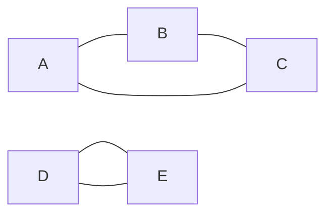
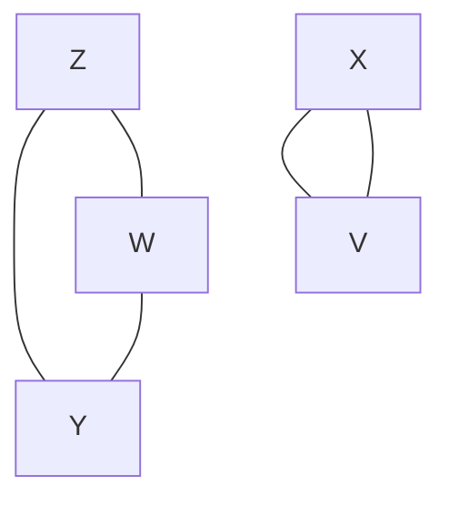

# Isomorphism

Prove that if two graphs $Z$ and $Y$ are isomorphic they do *not* have to
be completely connected. I have started with the formal definition of
isomorphism below. Add your answer to this markdown file. [This
page](https://docs.github.com/en/get-started/writing-on-github/working-with-advanced-formatting/writing-mathematical-expressions) might help with the notation for mathematical expressions.

$G_1=(V_1 , E_1)$ is isomorphic to $G_2 = (V_2, E_2)$ if there exists a
one-to-one and onto function (bijection) $f: V_1 \rightarrow V_2$ such that $(u,v) \in E_1$ iff $(f(u),f(v)) \in E_2$.

## Answer

Since I took COSC-2300 here at UW, I have very little experience using proof by contradiction, and thus I am going to take a crack at it here since I believe that it will be the most straight-forward approach.

Consider the following two not-completely-connected graphs:

$G_{1} = $

$G_{2} = $

We can see that neither graph is completely connected, and neither graph contain a common node. Therefore, if we can prove that these two graphs are isomorphic to each other, we will have found at least one valid case conveying that two isomorphic graphs do **not** need to be completely connected.

Suppose that $m(G_{1}, G_{2})$ is a bijective mapping between the two graphs depicted above, then $m$ can be defined as:

$$\begin{gather*}
m ({G_{1} \twoheadrightarrow G_{2}} \wedge G_{1} \rightarrowtail G_{2}) : &  \\
& A \mapsto Z \\
& B \mapsto W \\
& C \mapsto Y \\
& D \mapsto X \\
& E \mapsto V \\
\end{gather*}
$$

The mapping $m$ concisely depicts how each node **and** edge can be *(bijectively)* preserved between $G_{1}$ and $G_{2}$. That is, $m$ visually denotes that for every $(u, v) \in G_{1}$, there exists  a corresponding $(m(u), m(v)) \in G_{2}$. Therefore, we have found that **there exists** graphs that are *not* completely connected but *are* isomorphic to each other.